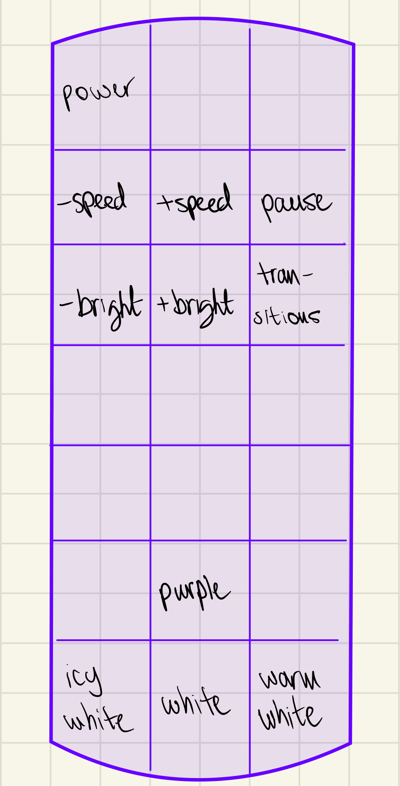
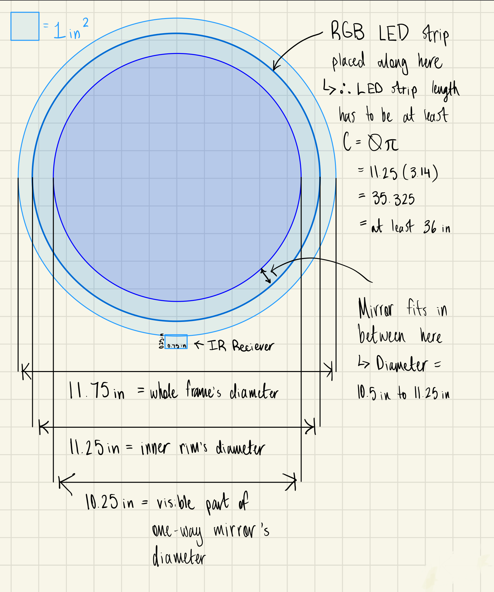
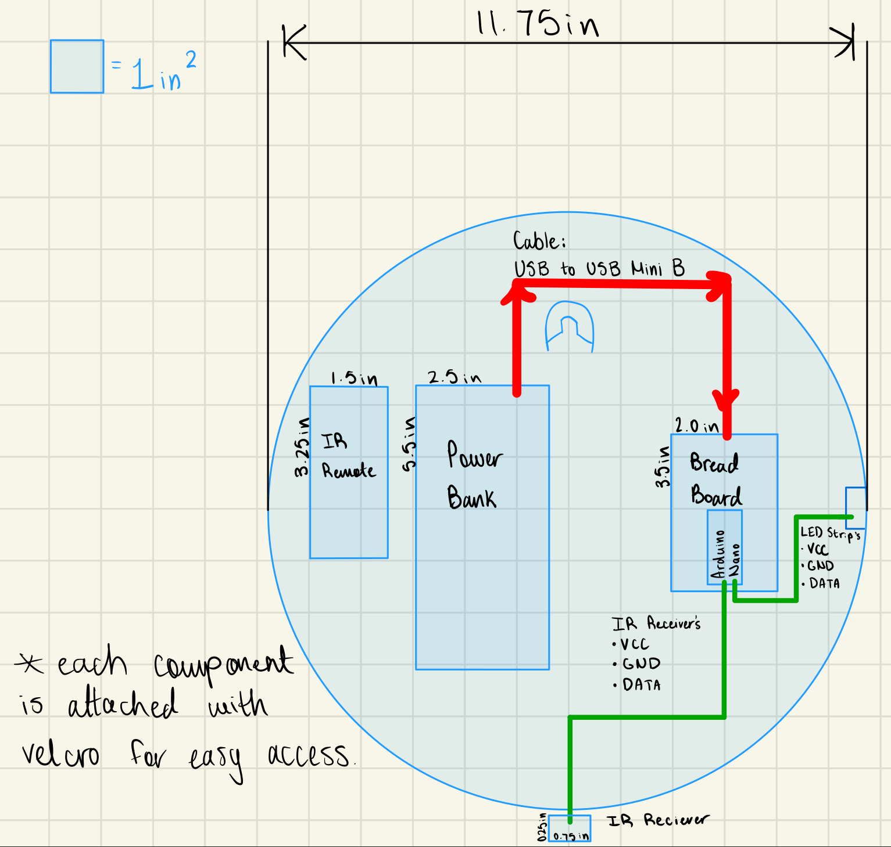
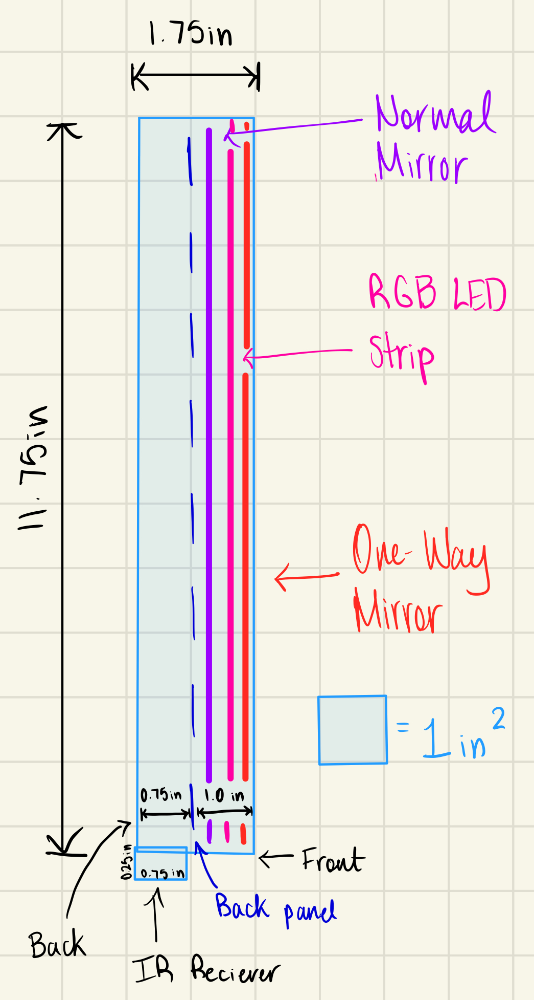
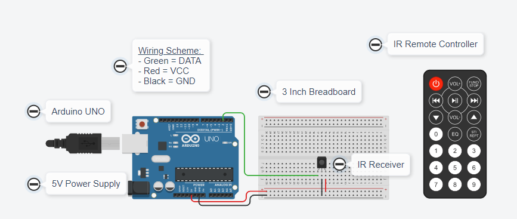
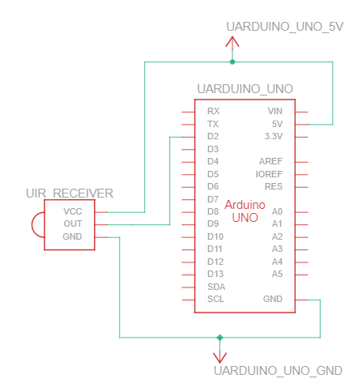
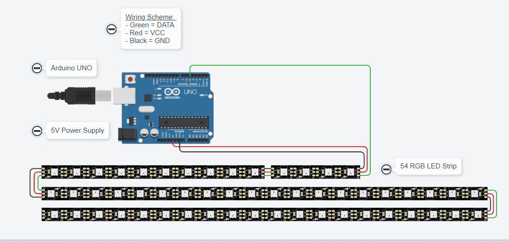
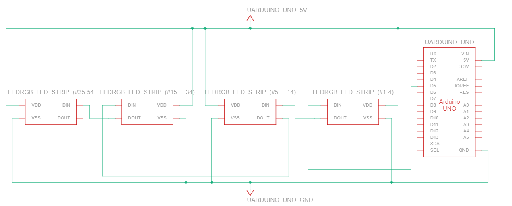

# Infinity Mirror Project

**Student:** Amaiam ul Haque  
**Student #:** 679376  
**Course:** TEJ4M0-A Computer Engineering  
**Instructor:** Mr. Di Iorio  
**Date:** January 25, 2023

## Table of Contents
1. [Scenario](#scenario)
2. [Summary](#summary)
3. [Operating Instructions](#operating-instructions)
4. [Problems & Possibilities](#problems--possibilities)
5. [Investigation & Ideas](#investigation--ideas)
6. [Research Findings](#research-findings)
7. [Appendix](#appendix)
8. [Construction](#construction)
9. [Evaluation](#evaluation)
10. [Bibliography](#bibliography)

## Scenario
This does not relate to any real-world problem. It is simply something made for pure recreational and entertainment purposes.

## Summary
The infinity mirror is mainly for decorative purposes, however it serves as a regular mirror while powered off. When turned on, it features smooth vivid transitions and various settings that allow the user to customize it to their liking. The final product was successful and highly immersive.

## Operating Instructions

### IR Remote Button Diagram


### Instructions
1. Ensure power supply is charged
2. Turn on with remote control
3. Default setting starts automatically
4. Swap color transitions using TRANSITION button
5. Pause/unpause with PAUSE button
6. Adjust brightness with VOL+/- buttons
7. Adjust speed with NEXT/PREV buttons
8. Select specific colors: 5 (Purple), 8 (White), 9 (Warm White), 7 (Icy White)
9. Turn off with POWER button

## Problems & Possibilities
- **Time Constraints**: Limited time for additional features like custom color ranges and saved settings
- **Resources**: Mirror adhesion issues with double-sided tape - would use stronger adhesive next time

## Investigation & Ideas

### Design Sketches
**Front View:**


**Back View:**


**Side View:**


### Component Specifications
- **IR Receiver**: VCC (power), GND (ground), OUT (data)
- **RGB LED Strip**: DIN (data in), DOUT (data out), VDD (chip voltage), VSS (ground)

## Research Findings
Learned about RGB LED color control (16.7 million colors using bytes for R,G,B) and IR remote signal decoding using FastLED and IRremote libraries.

## Appendix

### IR Receiver Wiring



### RGB LED Wiring



## Construction

### Parts List
| Quantity | Component Name |
|----------|----------------|
| 1x | Arduino Nano |
| 1x | USB A to Micro USB cable |
| 1x | Breadboard (3") |
| 1x | Addressable RGB LED Strip (1m) |
| 1x | Power Bank (5V 3A) |
| 1x | IR Remote Control |
| 1x | IR Receiver Module |
| 1x | One Way Mirror Film |
| 1x | Clock Frame |
| 1x | Glass from Frame |
| 1x | Circular Mirror |
| 1x | Window Film Application Kit |

### Construction Steps

#### Step 1: Research
- Researched coding, wiring, and mirror film application
- **Equipment**: Internet-connected device
- **Safety**: N/A

#### Step 2: LED Testing
- Tested all LED colors at max brightness
- **Equipment**: Arduino programming device
- **Safety**: Correct wiring to prevent short circuits

#### Step 3: IR Testing
- Retrieved remote control codes
- **Equipment**: Arduino programming device
- **Safety**: Care with spiky IR receiver components

#### Step 4: Mirror Film Application
- Applied film to glass using window application kit
- **Equipment**: Exacto knife, lint cloth, spray bottle
- **Safety**: Handle glass carefully, blade safety

#### Step 5: LED Strip Measurement
- Measured and cut LED strip to fit frame
- **Equipment**: Wire cutters
- **Safety**: Use safety lock on cutters

#### Step 6: Back Panel Modification
- Cut hole for wires in back panel
- **Equipment**: Exacto knife
- **Safety**: Blade safety precautions

#### Step 7: LED Installation
- Glued LED strip to inner rim
- **Equipment**: Strong adhesive
- **Safety**: Glove use, follow product safety

#### Step 8: Wiring and Mirror Installation
- Protected wires with tape, installed mirror
- **Equipment**: Black tape
- **Safety**: Handle glass/mirrors carefully

#### Step 9: Cleaning
- Cleaned mirror surfaces
- **Equipment**: Lint cloth
- **Safety**: Handle sharp edges carefully

#### Step 10: Final Assembly
- Assembled front screen and back panel
- **Equipment**: None
- **Safety**: Glass handling precautions

#### Step 11: Component Mounting
- Secured components with velcro
- **Equipment**: None
- **Safety**: Neat wire organization

#### Step 12: Programming
- Uploaded final code to Arduino
- **Equipment**: Programming device
- **Safety**: Organized workspace

#### Step 13: Cable Management
- Tidied wires with tape/zip ties
- **Equipment**: Tape, zip ties
- **Safety**: N/A

### Arduino Programs

#### Sketch 1: Basic LED Control
```cpp
#include <FastLED.h>
#define RGB_PIN 6
#define RGB_LED_NUM 10
#define BRIGHTNESS 200

CRGB LEDs[RGB_LED_NUM];

void setup() {
  Serial.begin(9600);
  FastLED.addLeds<WS2812B, RGB_PIN, GRB>(LEDs, RGB_LED_NUM);
  FastLED.setBrightness(BRIGHTNESS);
  FastLED.clear();
}

void loop() {
  Toggle_RED_LED();
}

void Toggle_RED_LED() {
  for (int i = 0; i < RGB_LED_NUM; i++)
    LEDs[i] = CRGB(255, 0, 0);
  FastLED.show();
  delay(1000);
  
  for (int i = 0; i < RGB_LED_NUM; i++)
    LEDs[i] = CRGB(0, 0, 0);
  FastLED.show();
  delay(1000);
}